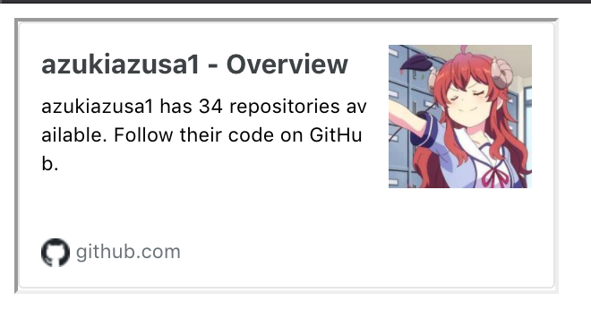

# remark-hatena-link-card

When the url matches the text and a line with only the url, it converts it to a Hatena blog link card.

## install 

```
npm innstall remark-hatena-link-card
```

## usage

* markdown

```
[https://github.com/azukiazusa1](https://github.com/azukiazusa1)

[https://github.com/azukiazusa1](https://github.com/azukiazusa1) link and other text line.

[my profile](https://github.com/azukiazusa1)
```

* script

```js
const fs = require('fs')
const path = require('path')
const remark = require('remark')
const html = require('remark-html')
const remarkCardLink = require('remark-hatena-link-card')

const base = path.join(__dirname, 'sample.md')
const processor = remark().use(remarkCardLink).use(html)

processor.process.then(({ contents }) => console.log(contents)
```

* output

```html
<p><div class="link-card"><iframe class="link-card--iframe" src="https://hatenablog-parts.com/embed?url=https://github.com/azukiazusa1"></iframe></div></p>
<p><a href="https://github.com/azukiazusa1">https://github.com/azukiazusa1</a> link and other text line</p>
<p><a href="https://github.com/azukiazusa1">my profile</a></p>
```

